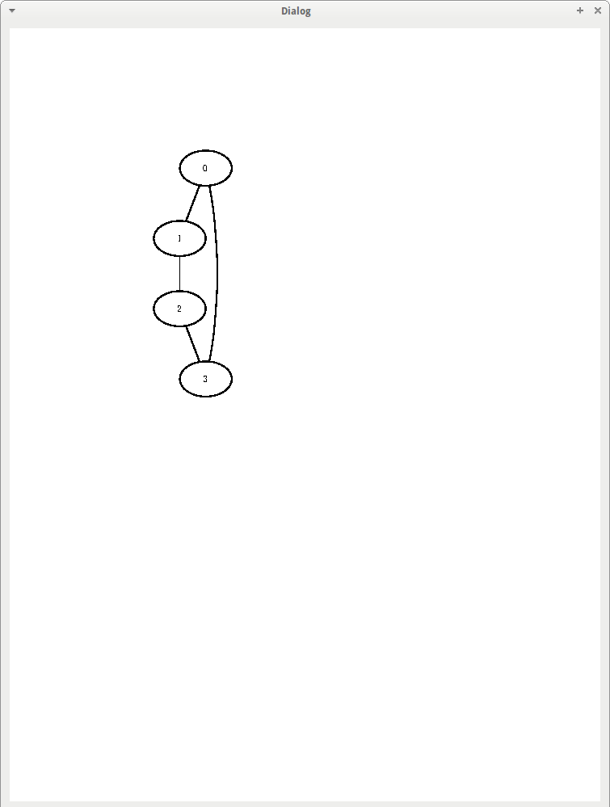

# boost_graph_example_4: four human names and their relationships + plotting

Branch|
---|---
master|

A [Boost.Graph example](https://github.com/richelbilderbeek/boost_graph_examples) that uses Graphviz.

It defines a graph of person names and their relationships. 
Then the graph is written to .dot file and plotted using KGraphViewer.

Related examples:

 * [boost_graph_example_1](https://github.com/richelbilderbeek/boost_graph_example_1)
 * [boost_graph_example_2](https://github.com/richelbilderbeek/boost_graph_example_2)
 * [boost_graph_example_3](https://github.com/richelbilderbeek/boost_graph_example_3)
 * [boost_graph_example_4](https://github.com/richelbilderbeek/boost_graph_example_4)
 * [boost_graph_example_5](https://github.com/richelbilderbeek/boost_graph_example_5)
 * [travis_qmake_gcc_cpp14_boost_graph](https://github.com/richelbilderbeek/travis_qmake_gcc_cpp14_boost_graph): part of [the Travis C++ Tutorial](https://github.com/richelbilderbeek/travis_cpp_tutorial)

